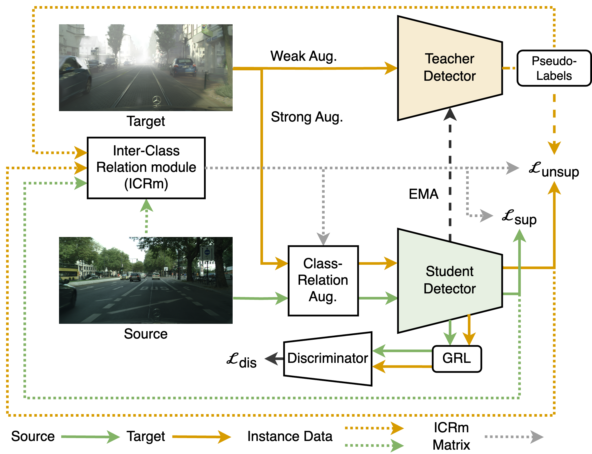

# CAT: Exploiting Inter-Class Dynamics for Domain Adaptive Object Detection

[](https://creativecommons.org/licenses/by-nc/4.0/) 

This repo is the official implementation of our paper:
CAT: Exploiting Inter-Class Dynamics for Domain Adaptive Object Detection
Mikhail Kennerley, Jian-Gang Wang, Bharadwaj Veeravalli, Robby T. Tan
IEEE/CVF Conference on Computer Vision and Pattern Recognition (CVPR), 2024
[[Paper](https://arxiv.org/abs/2403.19278)]


<p align="center">

</p>

# Installation

## Prerequisites

- Python ≥ 3.6
- PyTorch ≥ 1.5 and torchvision that matches the PyTorch installation.
- Detectron2 == 0.6 

## Our tested environment

- 4 3090 GPUs

## VGG-16
For the VGG backbone, we use the converted weights from [CMT](https://github.com/Shengcao-Cao/CMT/tree/main). Please put this file at `checkpoints/vgg16_bn-6c64b313_converted.pth`.

## Dataset download

1. Download the Cityscapes dataset

2. Organize the dataset following:

```shell
adaptive_teacher/
└── datasets/
    └── cityscapes/
        ├── gtFine/
            ├── train/
            └── test/
            └── val/
        ├── leftImg8bit/
            ├── train/
            └── test/
            └── val/
   └── cityscapes_foggy/
        ├── gtFine/
            ├── train/
            └── test/
            └── val/
        ├── leftImg8bit/
            ├── train/
            └── test/
            └── val/
    
```

# Training

- Train the Class-Aware Teacher under cityscapes (source) and foggy cityscapes (target)

```shell
python train_net.py\
      --num-gpus 4\
      --config configs/faster_rcnn_VGG_cross_city.yaml\
      OUTPUT_DIR output/exp_city
```

# Citation
If you use Class Aware Teacher in your research or wish to refer to the results published in our paper, please use the following BibTeX entry:
```BibTeX
@inproceedings{kennerley2024cat,
  title={CAT: Exploiting Inter-Class Dynamics for Domain Adaptive Object Detection},
  author={Mikhail Kennerley, Jian-Gang Wang, Bharadwaj Veeravalli, Robby T. Tan},
  booktitle={2024 IEEE/CVF Conference on Computer Vision and Pattern Recognition (CVPR)},
  year={2024},
}
```

# Acknowledgements
Code is adapted from [Detectron2](https://github.com/facebookresearch/detectron2) and [Adaptive Teacher](https://github.com/facebookresearch/adaptive_teacher).
